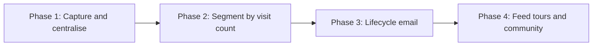

# Petit Grande Guest CRM — Project Direction

_Source: strategy meeting May 27, 2026 ([meetingdata @May 27, 2026.txt](./meetingdata%20@May%2027,%202026.txt))_

## 1. Scope decision

This project is a **guest data + lifecycle marketing engine**. Its job is to capture
every guest's contact details, recognise returning guests, and drive repeat stays
through targeted email.

It is **not** the vehicle for the broader business initiatives raised in the meeting
(tour packaging, butler service, driver hiring, Reels production). Those are real, but
they are downstream consumers of the CRM: once guest data is centralised and segmented,
each becomes a campaign or an audience inside the system.

### Why this scope

The meeting notes range widely, but three threads are tightly linked and form the only
buildable core of "GUEST CRM":

1. **The data foundation is broken.** The existing customer database "exists but [is] not
   being utilized," and there is no systematic email capture at check-in. Nothing
   downstream (newsletters, seasonal offers, repeat campaigns) can run until guest contact
   data is captured reliably and centralised.
2. **Repeat business is the growth lever.** The single most important number in the meeting
   is the repeat-rate curve: roughly **20–30%** of first-time guests return, **45–50%** of
   second-time, and **70%** of third-time. The highest-ROI work is therefore not new
   acquisition — it is a system that identifies returning guests and re-markets to them.
3. **Everything else is downstream.** Tour packages, butler-style support, Instagram/TikTok
   Reels, and Philippine drivers are business and ops initiatives, not CRM deliverables.

## 2. Phased roadmap

| Phase | Goal | Key outputs |
| --- | --- | --- |
| 1. Capture and centralise | One clean source of truth for guest contacts | Check-in email-capture SOP; migrated and de-duplicated database |
| 2. Segment by visit count | Make repeat guests visible and actionable | 1st / 2nd / 3rd+ visit tiering (the "tablecloth color-coding" idea) |
| 3. Lifecycle email | Convert visibility into repeat stays | Welcome, post-stay survey, seasonal offer, win-back flows + open/click tracking |
| 4. Feed tours and community | Reuse segments for the wider strategy | Tour-package offers and community/Reels funnels powered by CRM segments |

## 3. Platform decision

**ClickUp first as a prototype; migrate to a dedicated CRM/email tool once limits are hit.**

- ClickUp is the **record and ops layer** — guest records, visit tiering, task automation.
- ClickUp is **not** an email marketing platform. Sending is delegated to a dedicated tool.
  Postmark is provisioned in this workspace as the intended sending layer (see
  [Lifecycle-Email-Plan.md](./Lifecycle-Email-Plan.md)).

### ClickUp limit triggers (the off-ramp)

Migrate to a dedicated CRM/ESP (e.g. Brevo, Klaviyo, or HubSpot) when **any** of these appear:

- You need real audience **segmentation inside email** (beyond simple list exports).
- You need **automated multi-step drip sequences**, not single triggered tasks.
- You need **deliverability and open/click analytics** native to the platform.
- Guest **volume strains ClickUp list views** or makes manual upkeep error-prone.
- You need **consent/preference management** and unsubscribe handling at scale.

## 4. Out of scope (dependent initiatives)

These were discussed but are tracked as separate initiatives that consume CRM output, not
as part of this build:

- Tour package design (accommodation + transport + sightseeing).
- Butler-style full-support service model.
- Driver recruitment from the Philippines and licensing.
- Instagram / TikTok / Facebook Reels content production.
- Paid acquisition (Google Ads) and community-platform strategy.

## 5. Related documents

- [ClickUp-CRM-Blueprint.md](./ClickUp-CRM-Blueprint.md) — schema, pipelines, automations, SOP.
- [guest-import-template.csv](./guest-import-template.csv) — import + de-dup template.
- [Lifecycle-Email-Plan.md](./Lifecycle-Email-Plan.md) — email flows, metrics, Postmark handoff.
- [Client-Inputs-Needed.md](./Client-Inputs-Needed.md) — inputs required to proceed.
